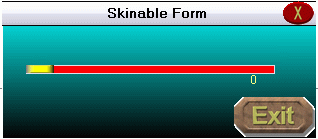



## Skinable form \- ScrollBar, Buttons, title, \.\.\.

### Description

Skin a form! Very easy way to skin your form!!
 
### More Info
 

             |
---                |---
**Submitted On**   |2003-12-07 12:41:40
**By**             |[Toth Arpad](https://github.com/Planet-Source-Code/PSCIndex/blob/master/ByAuthor/toth-arpad.md)
**Level**          |Beginner
**User Rating**    |5.0 (15 globes from 3 users)
**Compatibility**  |VB 6\.0
**Category**       |[Graphics](https://github.com/Planet-Source-Code/PSCIndex/blob/master/ByCategory/graphics__1-46.md)
**World**          |[Visual Basic](https://github.com/Planet-Source-Code/PSCIndex/blob/master/ByWorld/visual-basic.md)
**Archive File**   |[Skinable\_f1681521282003\.zip](https://github.com/Planet-Source-Code/toth-arpad-skinable-form-scrollbar-buttons-title__1-50367/archive/master.zip)

